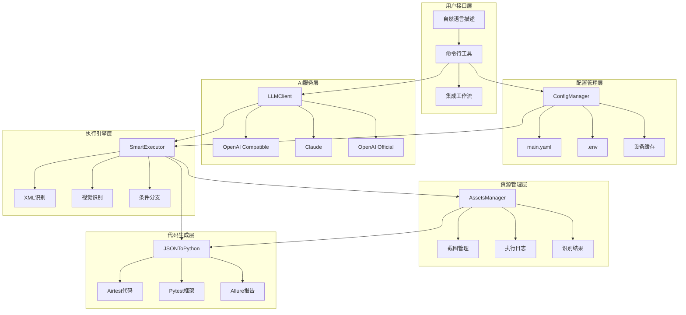

# Only-Test 综合技术文档

## 文档说明

本文档整合了项目中所有分散的技术文档，提供完整的技术参考。根据合并策略，当内容冲突时保留描述更详细的版本。

---

# 1. Only-Test 自动化测试框架

## 1.1 项目愿景

### 为什么要 Only-Test

使用 Airtest 能很快的写出一份 APK 的自动化用例，为什么还要花时间来打造这样一个自动化测试框架？

对我们而言有用的 UI 自动化用例至少要能跨 APK 测试。可即使能写出一份，难道那么多份都要手动写吗？

这样写出来的用例不具备通用性，Airtest 有 Poco(元素 ID) 视觉两种识别模式，即使完全使用 Poco 定位也会遇到跨 APK 时元素 name 改变后无法准确定位的问题。

### 核心问题

**UI 定位的缺陷：**
1. 无法跨设备
2. 无法跨 APK
3. 更无法跨越 TV 与 手机

**传统方案问题：**
- 每个 APK 都需要单独开发测试用例
- 元素 ID 改变导致测试用例失效
- 无法在不同设备间运行
- 播放状态下无法访问 UI 控件
- DRM 保护导致 TV 端无法截图

---

# 2. 框架架构设计

## 2.1 核心设计理念

**"告诉AI你想测什么，AI帮你完成一切"**

Only-Test 基于 **JSON + Python 协作架构** 设计，通过统一的配置管理系统和智能LLM集成，实现了完全自动化的移动端UI测试框架。

- **配置驱动**: 通过 YAML 配置文件管理设备、应用和测试套件信息
- **智能生成**: LLM 自动将自然语言转换为结构化测试用例
- **双模识别**: XML 和视觉识别智能切换，适应不同应用场景
- **完整追溯**: 所有执行过程和资源都有完整的记录和管理

## 2.2 系统架构图



## 2.3 目录结构与职责

```
airtest/
├── 📁 lib/                           # 核心库文件
│   ├── 📄 config_manager.py          # 配置管理器 - 统一配置访问入口
│   ├── 📁 llm_integration/           # LLM集成模块
│   │   └── 📄 llm_client.py          # 多提供商LLM客户端
│   ├── 📁 phone_use_core/            # phone-use 核心功能
│   ├── 📁 metadata_engine/           # 智能元数据处理
│   ├── 📁 execution_engine/          # 智能执行引擎
│   ├── 📁 code_generator/            # JSON到Python代码转换
│   ├── 📄 device_adapter.py          # 设备信息探测与适配
│   └── 📄 assets_manager.py          # 资源文件统一管理
├── 📁 testcases/                     # 测试用例目录
│   ├── 📄 main.yaml                  # 主配置文件 - 设备/应用/套件配置
│   ├── 📁 templates/                 # 用例模板
│   ├── 📁 generated/                 # LLM生成的JSON用例
│   ├── 📁 python/                    # 转换后的Python用例
│   └── 📁 manual/                    # 手动编写的用例
├── 📁 tools/                         # 开发工具
│   ├── 📄 case_generator.py          # 智能用例生成工具
│   ├── 📄 test_runner.py             # 测试运行器
│   ├── 📄 test_executor.py           # 集成执行器
│   └── 📄 integration_check.py       # 架构集成检查工具
├── 📁 assets/                        # 测试资源文件
│   └── 📁 {app}_{device}/            # 按应用+设备分类的资源
├── 📁 reports/                       # 测试报告
├── 📄 .env                           # 环境变量配置
└── 📄 README.md                      # 项目说明文档
```

---

# 3. 完整工作流程

## 3.1 工作流程图

```
自然语言测试需求 → LLM生成JSON用例 → 设备信息探测 → 智能执行测试 → 结果回写优化 → 报告生成
    ↓              ↓              ↓            ↓            ↓            ↓
   输入           智能元数据        设备适配      视觉识别      学习优化      可视化报告
```

## 3.2 详细工作流程

### 步骤1️⃣: 新APK新用例 - LLM智能生成

**用户输入**（自然语言）：
```
"在抖音APP中搜索'美食视频'，如果搜索框有历史记录先清空，然后点击第一个视频播放"
```

**LLM自动生成JSON智能用例**：
```json
{
  "testcase_id": "TC_DOUYIN_SEARCH_20241205",
  "name": "抖音美食视频搜索测试",
  "target_app": "com.mobile.brasiltvmobile",
  "execution_path": [
    {
      "step": 1,
      "action": "conditional_action",
      "condition": {
        "type": "element_content_check",
        "target": "search_input_box",
        "check": "has_text_content"
      },
      "conditional_paths": {
        "if_has_content": {
          "action": "click",
          "target": "clear_button",
          "reason": "清空历史搜索记录"
        },
        "if_empty": {
          "action": "input",
          "data": "美食视频"
        }
      },
      "business_logic": "智能判断搜索框状态，确保输入正确",
      "ai_hint": "寻找搜索框右侧的×清除按钮"
    }
  ]
}
```

### 步骤2️⃣: 试跑阶段 - 设备信息探测与适配

**自动设备探测**：
```python
device_info = {
    "device_name": "Pixel_6_Pro",
    "android_version": "13.0",
    "screen_resolution": "3120x1440",
    "screen_density": 560,
    "brand": "Google",
    "model": "Pixel 6 Pro"
}
```

**JSON用例自动更新**：
```json
{
  "device_adaptation": {
    "detected_device": "Pixel_6_Pro",
    "screen_info": {
      "resolution": "3120x1440", 
      "density": 560,
      "orientation": "portrait"
    },
    "adaptation_rules": {
      "touch_offset": {"x": 0, "y": 0},
      "element_scaling": 1.0,
      "recognition_mode": "hybrid"
    }
  },
  "execution_environment": {
    "android_version": "13.0",
    "target_sdk": 33,
    "permissions_granted": ["CAMERA", "STORAGE"],
    "network_status": "connected"
  }
}
```

### 步骤3️⃣: 智能执行阶段 - 视觉识别与信息保留

**执行过程中的智能处理**：

#### 3.1 双模式识别
```python
# 自动选择识别模式
if is_media_playing():
    recognition_mode = "visual"  # 视频播放时用视觉识别
    use_omniparser = True
else:
    recognition_mode = "xml"     # 静态界面用XML
    use_dump_ui = True
```

#### 3.2 截图和识别结果保存
```json
{
  "execution_results": {
    "step_1": {
      "timestamp": "2024-12-05T14:30:22Z",
      "screenshots": {
        "before_action": "assets/douyin_Pixel6Pro/step1_before_20241205_143022.png",
        "after_action": "assets/douyin_Pixel6Pro/step1_after_20241205_143025.png"
      },
      "recognition_data": {
        "mode": "visual",
        "elements_found": [
          {
            "type": "input_field",
            "text": "历史搜索内容", 
            "confidence": 0.95,
            "coordinates": {"x": 540, "y": 200, "width": 300, "height": 50},
            "screenshot": "assets/douyin_Pixel6Pro/step1_element_input_20241205_143022.png"
          }
        ],
        "omniparser_result": "assets/douyin_Pixel6Pro/step1_omni_result.json"
      }
    }
  }
}
```

#### 3.3 路径组织规则
```
assets/
├── {app_package}_{device_name}/     # 按应用和设备分类
│   ├── step1_before_20241205_143022.png        # 步骤执行前截图
│   ├── step1_after_20241205_143025.png         # 步骤执行后截图  
│   ├── step1_element_input_20241205_143022.png # 识别到的元素截图
│   ├── step1_omni_result.json                  # Omniparser识别结果
│   └── execution_log.json                      # 执行日志
└── douyin_Pixel6Pro/
    └── (具体文件...)
```

---

# 4. 核心组件详解

## 4.1 ConfigManager - 配置管理核心

**职责**: 统一管理所有配置信息，提供类型安全的配置访问接口

**核心功能**:
- 📋 设备配置管理 (硬件信息、执行配置、识别配置)
- 📱 应用配置管理 (包名、启动配置、业务场景)
- 🧪 测试套件管理 (设备组合、应用组合、测试场景)
- 🤖 LLM服务配置 (API密钥、模型选择、参数配置)
- 📂 路径模板管理 (资源路径、报告路径、代码路径)
- 💾 设备信息缓存 (避免重复探测)

**配置结构**:
```yaml
# main.yaml 核心配置
global_config:          # 全局配置
devices:                # 设备配置组
  device_id:
    phone_type: "android_phone"
    screen_info: {...}   # 屏幕信息
    execution_config: {...}  # 执行配置
    recognition_config: {...}  # 识别配置
applications:           # 应用配置组  
  app_id:
    package_name: "..."
    app_config: {...}    # 应用特定配置
test_suites:           # 测试套件配置
llm_config:            # LLM配置
path_templates:        # 路径模板
```

## 4.2 LLMClient - 智能服务集成

**职责**: 提供统一的LLM服务接口，支持多提供商和自动回退

**支持的LLM提供商**:
- 🔵 OpenAI Compatible API (默认推荐)
- 🟢 OpenAI Official API  
- 🟣 Anthropic Claude API

**核心功能**:
- 🤖 智能测试用例生成 (自然语言 → JSON结构)
- 📝 测试用例质量审查 (逻辑完整性、选择器准确性)
- 🔄 自动重试和错误处理
- 🎯 回退机制 (主服务 → 备用服务)
- 📊 使用统计和监控

**LLM配置示例**:
```bash
# .env 配置
LLM_PROVIDER=openai_compatible
LLM_API_URL=https://api.llmproai.xyz/v1/chat/completions
LLM_API_KEY=sk-xxx
LLM_MODEL=gpt-oss-120b

# 备用配置
LLM_FALLBACK_PROVIDER=openai
LLM_FALLBACK_API_KEY=sk-xxx
LLM_FALLBACK_MODEL=gpt-3.5-turbo
```

## 4.3 SmartExecutor - 智能执行引擎

**职责**: 执行JSON测试用例，处理条件分支逻辑和双模识别

**核心特性**:
- 🧠 **条件分支处理**: 
  - "如果搜索框有内容先清空" → 自动判断并选择执行路径
  - 支持多层嵌套条件逻辑
- 🔍 **双模识别系统**:
  - 静态界面: XML/UIAutomator2 (快速、准确)
  - 动态内容: Omniparser视觉识别 (媒体播放时)
- 📸 **智能截图管理**: 执行前后自动截图
- 📝 **完整执行记录**: 每步操作都有详细日志
- ⚡ **性能优化**: 识别模式智能切换，减少不必要开销

---

# 5. 安装配置指南

## 5.1 系统要求

### 软件要求
- **Python**: 3.8 或更高版本 (推荐 3.9+)
- **操作系统**: Windows 10/11, macOS 10.15+, Ubuntu 18.04+
- **Android设备**: Android 5.0 (API 21) 或更高版本
- **Java**: JDK 8 或更高版本

### 硬件要求
- **内存**: 最小 4GB RAM (推荐 8GB+)
- **存储**: 最小 2GB 可用空间
- **网络**: 稳定的网络连接 (用于LLM API调用)

## 5.2 快速安装

### 1. 克隆项目
```bash
git clone <repository-url>
cd airtest
```

### 2. 创建虚拟环境 (推荐)
```bash
# 使用 venv
python -m venv only_test_env
source only_test_env/bin/activate  # Linux/macOS
# 或
only_test_env\Scripts\activate     # Windows

# 使用 conda
conda create -n only_test python=3.9
conda activate only_test
```

### 3. 安装依赖
```bash
pip install -r requirements.txt
```

### 4. 配置环境变量
```bash
# 复制环境配置文件
cp .env.example .env

# 编辑配置文件，填入你的API密钥
nano .env  # 或使用其他编辑器
```

### 5. 验证安装
```bash
python tools/integration_check.py
```

## 5.3 详细配置

### 环境变量配置 (.env)

```bash
# === LLM服务配置 ===
LLM_PROVIDER=openai_compatible
LLM_API_URL=https://your-api-endpoint.com/v1/chat/completions
LLM_API_KEY=sk-your-api-key-here
LLM_MODEL=gpt-4
LLM_TEMPERATURE=0.7

# === 备用LLM配置 ===
LLM_FALLBACK_PROVIDER=openai
LLM_FALLBACK_API_KEY=sk-your-fallback-key
LLM_FALLBACK_MODEL=gpt-3.5-turbo

# === 开发环境配置 ===
ENVIRONMENT=development
DEBUG=true
LOG_LEVEL=DEBUG
```

### 主配置文件 (testcases/main.yaml)

参考现有的 `main.yaml` 文件，根据你的设备和应用进行配置：

```yaml
devices:
  your_device_id:
    phone_type: "android_phone"
    custom_name: "Your Device Name"
    android_version: "13"
    screen_info:
      resolution: "1080x1920"
      density: 420

applications:
  your_app:
    package_name: "com.your.app"
    app_name: "Your App"
    category: "your_category"
```

---

# 6. 使用指南

## 6.1 快速开始

### 1. 环境准备

```bash
# 确保你在 airtest 目录下
cd /path/to/uni/airtest

# 检查目录结构
ls -la
# 应该看到: lib/, testcases/, tools/, config/, reports/ 等目录
```

### 2. 第一次运行演示

```bash
# 运行内置演示用例
python tools/test_runner.py --demo

# 查看生成的演示用例
cat testcases/generated/demo_smart_search.json
```

### 3. 生成你的第一个测试用例

```bash
# 基于自然语言生成用例
python tools/case_generator.py \
  --description "在爱奇艺APP中搜索电影复仇者联盟，点击第一个结果播放" \
  --app "com.qiyi.video" \
  --device "android_phone"

# 查看生成的用例
ls testcases/generated/
```

### 4. 运行生成的测试用例

```bash
# 运行单个测试用例
python tools/test_runner.py --file testcases/generated/tc_com_qiyi_video_*.json

# 查看HTML报告
open reports/test_report_*.html
```

## 6.2 智能元数据详解

### 核心设计理念

传统测试用例只描述"做什么"，Only-Test 的智能元数据描述"为什么这样做"和"如何智能判断"。

```yaml
传统方式:
  - 点击搜索按钮
  - 输入搜索词
  - 点击确认

Only-Test 方式:
  - 🧠 检查搜索框状态
  - 📋 如果有内容 → 先清空再输入
  - 📋 如果无内容 → 直接输入
  - ✅ 智能确认搜索执行
```

### 关键元数据字段

#### 1. 条件分支逻辑
```json
{
  "action": "conditional_action",
  "condition": {
    "type": "element_content_check",
    "target": "search_input_box",
    "check": "has_text_content"
  },
  "conditional_paths": {
    "if_has_content": { "action": "click", "target": "clear_button" },
    "if_empty": { "action": "input", "data": "搜索词" }
  }
}
```

#### 2. AI友好描述
```json
{
  "description": "根据搜索框状态智能选择操作",
  "ai_hint": "寻找输入框右侧的清除按钮，通常是×符号",
  "business_logic": "确保搜索框处于正确状态",
  "reason": "搜索框已有内容，需要先清空"
}
```

---

# 7. 执行与监控

## 7.1 单个用例执行

```bash
# 运行指定用例
python tools/test_runner.py --file testcases/generated/my_test.json

# 指定设备
python tools/test_runner.py --file testcases/generated/my_test.json --device "emulator-5554"

# 只生成JSON报告
python tools/test_runner.py --file testcases/generated/my_test.json --report json
```

## 7.2 批量执行

```bash
# 运行目录中所有用例
python tools/test_runner.py --dir testcases/generated/

# 运行手动编写的用例
python tools/test_runner.py --dir testcases/manual/

# 生成HTML和JSON报告
python tools/test_runner.py --dir testcases/generated/ --report both
```

## 7.3 执行过程监控

执行时你会看到详细的智能决策过程：

```
📋 测试用例信息
============================================================
📝 名称: 智能搜索功能测试
🧠 智能条件步骤: 2个
   1. 根据搜索框状态智能选择操作
      └─ 条件: element_content_check - has_text_content
   2. 确保搜索词正确输入

🚀 开始执行测试用例: 智能搜索功能测试
▶️  Step 1: 点击首页搜索按钮
▶️  Step 2: 根据搜索框状态智能选择操作
🧠 执行条件分支逻辑
🎯 条件评估结果: True
📍 选择路径: click -> clear_button
💡 选择原因: 搜索框已有内容，需要先清空

✅ 测试用例执行完成: 智能搜索功能测试
📊 整体状态: success
⏱️  总耗时: 15.32 秒
🔄 恢复次数: 0
```

---

# 8. Phone-Use MCP 集成

## 8.1 设计理念

Phone MCP Plugin 是一个强大的 MCP 插件，证明了 LLM + MCP 可以成功控制 Android APK 操作，具有确定性的自动化，最终实现 APK 自动化测试的自动测试用例生成。

## 8.2 智能双模识别系统

### 核心创新: 自适应UI识别
系统根据实时应用状态智能切换两种识别模式:

#### 🔄 **模式1: dump_ui (uiautomator2) - 快速精准**
- **使用场景**: 普通应用状态、暂停视频播放、静态UI元素
- **优势**: 闪电般快速响应、可访问元素100%准确率
- **技术**: 原生Android uiautomator2 XML层级解析

#### 🔍 **模式2: omniparser (AI视觉识别) - 全面覆盖**
- **使用场景**: 视频播放、动态内容、不可访问UI元素  
- **优势**: 适用任何视觉内容，处理复杂媒体界面
- **技术**: YOLO + PaddleOCR计算机视觉，~90%准确率，GPU密集
- **权衡**: 处理较慢，需要GPU资源，错误率更高

### 🤖 自动模式选择逻辑
系统使用多层状态分析**自动检测**最佳识别模式:

#### 🎯 **智能状态检测流水线**
```
XML状态检测 → 媒体播放检测 → 元素可访问性分析 → 模式智能选择
    ↓              ↓                ↓                   ↓
   快速            视觉              混合               最优策略
```

## 8.3 核心组件

**主入口点:**
- `phone_mcp/__main__.py` - MCP服务器入口，全面工具注册
- `phone_mcp/cli.py` - 命令行界面
- `phone_mcp/core.py` - 核心ADB命令执行和设备连接逻辑

**高级视觉识别工具 (phone_mcp/tools/):**
- `omniparser_interface.py` - **核心Omniparser集成**，视觉元素识别
- `omniparser_tools.py` - **MCP兼容Omniparser函数**，精确UI交互
- `prompt_engineering.py` - **AI任务指导系统**，偏差检测和定位帮助
- `android_computer_integration.py` - 增强的Android自动化，坐标回退

**传统工具模块:**
- `adb_tools.py` - 文件操作、APK安装、系统控制
- `apps.py` - 应用启动和管理  
- `media.py` - 截图、屏幕录制
- `screen_interface.py` - 基础屏幕交互和分析
- `ui_monitor.py` - UI变化监控和自动化
- `system.py` - 系统信息和设备管理
- `maps.py` - 基于位置的服务和POI搜索
- `interactions.py` - 统一交互接口

## 8.4 关键特性与能力

#### 视觉识别与精确交互
- **Omniparser集成**: 使用计算机视觉(YOLO + PaddleOCR)进行视觉UI元素识别
- **基于UUID的元素定位**: 每个UI元素获得唯一标识符，实现精确交互
- **偏差矫正**: 媒体内容中标题出现在可点击区域下方时的自动矫正
- **回退系统**: 视觉识别失败时基于坐标的交互

#### AI增强自动化
- **任务指导系统**: 不同自动化场景的智能提示
- **偏差检测**: 自动检测何时需要偏差矫正
- **定位指导**: 元素交互策略的智能建议
- **上下文感知交互**: 根据内容类型调整交互方式

#### 工具架构
- **30+个MCP工具**: 电话控制功能的全面覆盖
- **分层功能**: 专业视觉工具 + 基础ADB操作 + 辅助功能
- **服务器集成**: Omniparser服务器通信(默认: http://100.122.57.128:9333)

---

# 9. 协作架构设计

## 9.1 多组件协作机制

Only-Test 框架通过精心设计的接口和协议实现各组件间的无缝协作：

### 🔗 组件间通信协议
- **JSON消息格式**: 统一的数据交换格式
- **事件驱动架构**: 基于事件的异步通信
- **错误传播机制**: 完整的错误处理和恢复链
- **状态同步**: 实时的组件状态同步

### 📊 数据流设计
```
用户输入 → 配置管理器 → LLM客户端 → 测试生成器
                                    ↓
设备适配器 ← 资源管理器 ← 执行引擎 ← JSON用例
    ↓              ↓         ↓
 设备信息     → 执行记录  → 执行结果
    ↓              ↓         ↓
代码生成器 ← 报告生成器 ← 结果分析器
```

### 🤝 接口标准化
- **统一的配置接口**: 所有组件共享配置访问标准
- **标准化的执行接口**: 一致的测试执行协议
- **规范化的结果格式**: 统一的结果数据结构
- **可扩展的插件接口**: 支持第三方组件集成

## 9.2 智能协同特性

### 🧠 智能决策协作
- **多层智能判断**: LLM、规则引擎、条件逻辑的协同决策
- **上下文感知**: 各组件共享应用状态和设备信息
- **自适应优化**: 基于执行历史的动态策略调整
- **异常协同处理**: 多组件联合的异常恢复机制

### 🔄 实时反馈循环
- **执行状态实时同步**: 各组件的执行状态实时共享
- **性能指标收集**: 全链路性能数据统计
- **质量反馈机制**: 执行质量的实时评估和改进
- **学习数据积累**: 执行经验的持续学习和应用

---

# 10. 常见问题解决

## 10.1 安装相关问题

### 问题1: 找不到Python模块
```bash
# 错误: ModuleNotFoundError: No module named 'yaml'
pip install pyyaml>=6.0

# 错误: No module named 'openai'
pip install openai>=1.0.0
```

### 问题2: ADB设备连接失败
```bash
# 检查ADB版本
adb version

# 重启ADB服务
adb kill-server && adb start-server

# 检查设备权限
adb shell pm list permissions | grep android.permission
```

### 问题3: UIAutomator2连接失败
```bash
# 重新安装UIAutomator2服务
python -m uiautomator2 init

# 检查服务状态
adb shell am instrument -e debug false -w com.github.uiautomator.test/androidx.test.runner.AndroidJUnitRunner
```

### 问题4: LLM API调用失败
```bash
# 检查网络连接
curl -I https://api.openai.com

# 验证API密钥
python -c "
from openai import OpenAI
client = OpenAI(api_key='your-key')
print('API Key 有效:', bool(client))
"
```

### 问题5: 权限问题
```bash
# Linux/macOS 权限修复
chmod +x tools/*.py
chmod +x lib/*.py

# Windows 权限问题
# 以管理员身份运行终端
```

## 10.2 使用相关问题

### Q: 什么时候使用条件分支逻辑？

**A:** 当测试步骤需要根据界面状态动态选择操作时：

- 搜索框可能有历史内容需要清空
- 登录状态不确定需要判断
- 弹窗出现与否需要处理
- 不同设备的界面布局差异

### Q: 如何提高元素识别的准确性？

**A:** 使用多重选择器策略：

```json
{
  "target": {
    "priority_selectors": [
      {"resource_id": "precise_id"},           // 最准确
      {"content_desc": "描述文字"},            // 次选
      {"text": "显示文字"},                    // 备选
      {"xpath": "//xpath/expression"},        // 降级
      {"visual_hint": "视觉识别描述"}          // 兜底
    ]
  }
}
```

### Q: 执行失败时如何调试？

**A:** 检查以下几点：

1. **查看截图**: `reports/debug_step_*.png`
2. **检查日志**: 执行时的详细日志输出
3. **验证选择器**: 确认元素选择器是否正确
4. **测试条件逻辑**: 检查条件判断是否符合预期

### Q: 如何集成到 CI/CD？

**A:** 创建自动化脚本：

```bash
#!/bin/bash
# run_tests.sh

# 生成测试用例
python tools/case_generator.py --dir testcases/templates/ --output testcases/generated/

# 执行所有用例
python tools/test_runner.py --dir testcases/generated/ --report json

# 检查结果
if [ $? -eq 0 ]; then
  echo "✅ All tests passed"
  exit 0
else
  echo "❌ Some tests failed"
  exit 1
fi
```

---

# 11. 实践案例

## 11.1 案例1：音乐APP智能搜索

```bash
# 生成用例
python tools/case_generator.py \
  --description "在网易云音乐中搜索'告白气球'，如果搜索历史有内容先清空" \
  --app "com.netease.cloudmusic"

# 执行用例
python tools/test_runner.py --file testcases/generated/tc_com_netease_cloudmusic_*.json
```

**智能特性展示**：
- 自动检测搜索框状态
- 智能选择清空或直接输入
- 验证搜索结果相关性

## 11.2 案例2：视频APP条件导航

```bash
# 生成复杂导航用例
python tools/case_generator.py \
  --description "打开爱奇艺，如果有登录弹窗就关闭，搜索'流浪地球'并播放第一个结果" \
  --app "com.qiyi.video"
```

**智能特性展示**：
- 弹窗检测和处理
- 多层条件判断
- 智能异常恢复

## 11.3 案例3：电商APP购物流程

创建 `testcases/manual/smart_shopping.json`：

```json
{
  "name": "智能购物流程测试",
  "execution_path": [
    {
      "step": 1,
      "action": "conditional_action",
      "condition": {
        "type": "element_exists",
        "target": {"text": "登录"}
      },
      "conditional_paths": {
        "if_true": {
          "action": "click",
          "target": {"text": "登录"},
          "reason": "用户未登录，需要先登录"
        },
        "if_false": {
          "action": "click", 
          "target": {"resource_id": "search_box"},
          "reason": "用户已登录，直接搜索商品"
        }
      }
    }
  ]
}
```

## 11.4 案例4：跨设备适配测试

```bash
# 手机版本
python tools/case_generator.py \
  --template "smart_search_template" \
  --app "com.example.app" \
  --device "android_phone"

# TV版本  
python tools/case_generator.py \
  --template "smart_search_template" \
  --app "com.example.app.tv" \
  --device "android_tv"
```

---

# 12. 高级配置

## 12.1 多设备并行测试
```yaml
# main.yaml 中配置多个设备
devices:
  device1:
    custom_name: "Pixel 6 Pro"
    connection:
      adb_serial: "123456789"
  device2:
    custom_name: "Samsung Galaxy"
    connection:
      adb_serial: "987654321"
```

## 12.2 自定义LLM提供商
```python
# 扩展 LLMClient 支持自定义API
from lib.llm_integration.llm_client import BaseLLMProvider

class CustomLLMProvider(BaseLLMProvider):
    def chat_completion(self, messages, **kwargs):
        # 实现你的自定义LLM接口
        pass
```

## 12.3 持续集成配置
```yaml
# .github/workflows/test.yml
name: Only-Test CI
on: [push, pull_request]
jobs:
  test:
    runs-on: ubuntu-latest
    steps:
    - uses: actions/checkout@v3
    - uses: actions/setup-python@v4
      with:
        python-version: '3.9'
    - run: pip install -r requirements.txt
    - run: python tools/integration_check.py
```

---

# 13. 性能优化

## 13.1 配置缓存
- 设备信息缓存 (24小时有效期)
- 配置文件变更检测
- 内存配置缓存

## 13.2 执行优化
- 识别模式智能切换
- 截图质量动态调整
- 并发测试支持

## 13.3 资源管理
- 过期资源自动清理
- 压缩图片存储
- 异步日志写入

---

# 14. 监控与调试

## 14.1 日志系统
- 分级日志记录 (DEBUG/INFO/WARN/ERROR)
- 结构化日志格式
- 日志轮转和归档

## 14.2 监控指标
- LLM API调用统计
- 测试执行时间分析
- 设备连接成功率
- 识别准确率统计

## 14.3 调试支持
- 详细执行轨迹
- 断点调试支持
- 实时执行状态查看
- 资源文件完整保存

---

# 15. 扩展性设计

## 15.1 LLM提供商扩展
```python
class CustomLLMProvider(BaseLLMProvider):
    def chat_completion(self, messages, **kwargs):
        # 实现自定义LLM接口
        pass
```

## 15.2 识别引擎扩展
```python
class CustomRecognitionEngine:
    def recognize_elements(self, screenshot):
        # 实现自定义识别逻辑
        pass
```

## 15.3 条件类型扩展
```json
{
  "condition": {
    "type": "custom_condition_type",
    "custom_params": {...}
  }
}
```

## 15.4 报告格式扩展
- HTML报告模板自定义
- JSON报告字段扩展
- 第三方报告系统集成

---

# 16. 安全设计

## 16.1 敏感信息保护
- API密钥存储在环境变量中
- 配置文件不包含敏感信息
- Git忽略 .env 文件

## 16.2 权限控制
- 文件访问权限检查
- API调用频率限制
- 设备连接安全验证

---

# 总结

Only-Test 通过精心设计的分层架构，实现了：

✅ **配置驱动的统一管理** - 一次配置，多处使用  
✅ **智能LLM集成** - 自然语言直接生成测试用例  
✅ **双模识别系统** - 静态和动态UI的智能处理  
✅ **完整的执行追溯** - 每个操作都有完整记录  
✅ **高度可扩展架构** - 支持自定义扩展各个组件  
✅ **企业级安全性** - 敏感信息安全保护  
✅ **专业化工具链** - 从生成到执行到报告的完整流程

Only-Test 框架的核心价值：

1. **🧠 智能化**：真正理解UI状态，智能选择操作路径
2. **🔄 自适应**：自动适配不同应用和设备
3. **📋 标准化**：统一的元数据格式，便于维护
4. **🤖 AI驱动**：LLM辅助生成，提高开发效率
5. **🛡️ 可靠性**：多层异常恢复，确保执行稳定

通过智能元数据和条件分支逻辑，真正实现了"**Write Once, Test Everywhere**"的理念！这就是真正面向未来的移动端UI自动化测试框架！🚀

---

**Happy Testing!** 🎯