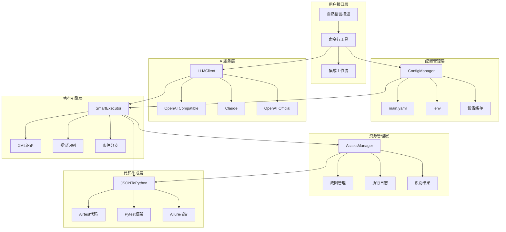
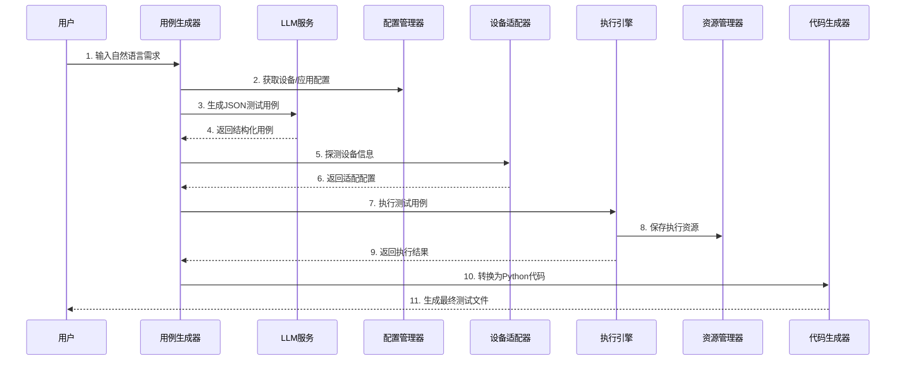

# 🏗️ Only-Test 架构设计文档

## 📋 架构概览

Only-Test 基于 **JSON + Python 协作架构** 设计，通过统一的配置管理系统和智能LLM集成，实现了完全自动化的移动端UI测试框架。

### 🎯 核心设计理念

- **配置驱动**: 通过 YAML 配置文件管理设备、应用和测试套件信息
- **智能生成**: LLM 自动将自然语言转换为结构化测试用例
- **双模识别**: XML 和视觉识别智能切换，适应不同应用场景
- **完整追溯**: 所有执行过程和资源都有完整的记录和管理

## 🏛️ 系统架构图



## 📁 目录结构与职责

```
airtest/
├── 📁 lib/                           # 核心库文件
│   ├── 📄 config_manager.py          # 配置管理器 - 统一配置访问入口
│   ├── 📁 llm_integration/           # LLM集成模块
│   │   └── 📄 llm_client.py          # 多提供商LLM客户端
│   ├── 📁 phone_use_core/            # phone-use 核心功能
│   ├── 📁 metadata_engine/           # 智能元数据处理
│   ├── 📁 execution_engine/          # 智能执行引擎
│   ├── 📁 code_generator/            # JSON到Python代码转换
│   ├── 📄 device_adapter.py          # 设备信息探测与适配
│   └── 📄 assets_manager.py          # 资源文件统一管理
├── 📁 testcases/                     # 测试用例目录
│   ├── 📄 main.yaml                  # 主配置文件 - 设备/应用/套件配置
│   ├── 📁 templates/                 # 用例模板
│   ├── 📁 generated/                 # LLM生成的JSON用例
│   ├── 📁 python/                    # 转换后的Python用例
│   └── 📁 manual/                    # 手动编写的用例
├── 📁 tools/                         # 开发工具
│   ├── 📄 case_generator.py          # 智能用例生成工具
│   ├── 📄 test_runner.py             # 测试运行器
│   ├── 📄 test_executor.py           # 集成执行器
│   └── 📄 integration_check.py       # 架构集成检查工具
├── 📁 assets/                        # 测试资源文件
│   └── 📁 {app}_{device}/            # 按应用+设备分类的资源
├── 📁 reports/                       # 测试报告
├── 📄 .env                           # 环境变量配置
└── 📄 README.md                      # 项目说明文档
```

## 🔧 核心组件详解

### 1. ConfigManager - 配置管理核心

**职责**: 统一管理所有配置信息，提供类型安全的配置访问接口

**核心功能**:
- 📋 设备配置管理 (硬件信息、执行配置、识别配置)
- 📱 应用配置管理 (包名、启动配置、业务场景)
- 🧪 测试套件管理 (设备组合、应用组合、测试场景)
- 🤖 LLM服务配置 (API密钥、模型选择、参数配置)
- 📂 路径模板管理 (资源路径、报告路径、代码路径)
- 💾 设备信息缓存 (避免重复探测)

**配置结构**:
```yaml
# main.yaml 核心配置
global_config:          # 全局配置
devices:                # 设备配置组
  device_id:
    phone_type: "android_phone"
    screen_info: {...}   # 屏幕信息
    execution_config: {...}  # 执行配置
    recognition_config: {...}  # 识别配置
applications:           # 应用配置组  
  app_id:
    package_name: "..."
    app_config: {...}    # 应用特定配置
test_suites:           # 测试套件配置
llm_config:            # LLM配置
path_templates:        # 路径模板
```

### 2. LLMClient - 智能服务集成

**职责**: 提供统一的LLM服务接口，支持多提供商和自动回退

**支持的LLM提供商**:
- 🔵 OpenAI Compatible API (默认推荐)
- 🟢 OpenAI Official API  
- 🟣 Anthropic Claude API

**核心功能**:
- 🤖 智能测试用例生成 (自然语言 → JSON结构)
- 📝 测试用例质量审查 (逻辑完整性、选择器准确性)
- 🔄 自动重试和错误处理
- 🎯 回退机制 (主服务 → 备用服务)
- 📊 使用统计和监控

**LLM配置示例**:
```bash
# .env 配置
LLM_PROVIDER=openai_compatible
LLM_API_URL=https://api.llmproai.xyz/v1/chat/completions
LLM_API_KEY=sk-xxx
LLM_MODEL=gpt-oss-120b

# 备用配置
LLM_FALLBACK_PROVIDER=openai
LLM_FALLBACK_API_KEY=sk-xxx
LLM_FALLBACK_MODEL=gpt-3.5-turbo
```

### 3. SmartExecutor - 智能执行引擎

**职责**: 执行JSON测试用例，处理条件分支逻辑和双模识别

**核心特性**:
- 🧠 **条件分支处理**: 
  - "如果搜索框有内容先清空" → 自动判断并选择执行路径
  - 支持多层嵌套条件逻辑
- 🔍 **双模识别系统**:
  - 静态界面: XML/UIAutomator2 (快速、准确)
  - 动态内容: Omniparser视觉识别 (媒体播放时)
- 📸 **智能截图管理**: 执行前后自动截图
- 📝 **完整执行记录**: 每步操作都有详细日志
- ⚡ **性能优化**: 识别模式智能切换，减少不必要开销

### 4. AssetsManager - 资源统一管理

**职责**: 管理所有测试执行过程中产生的资源文件

**资源命名规则**:
```
assets/{app_package}_{device_model}/
├── step01_click_before_20241205_143022.png      # 操作前截图
├── step01_click_after_20241205_143025.png       # 操作后截图  
├── step02_omni_result_20241205_143032.json      # 视觉识别结果
├── step02_conditional_decision_20241205.json    # 条件判断过程
└── execution_log.jsonl                          # 执行日志
```

**核心功能**:
- 📁 **标准化路径管理**: {包名}_{设备型号} 格式
- ⏰ **时间戳精确到毫秒**: 确保文件名唯一性
- 📊 **相对路径存储**: JSON中记录相对路径便于移植
- 🗂️ **会话级管理**: 每次执行创建独立会话目录
- 🧹 **自动清理**: 支持按时间清理过期资源

### 5. JSONToPython - 代码生成引擎

**职责**: 将JSON测试用例转换为可执行的Python代码

**生成的代码特性**:
- 🐍 **Airtest框架**: 移动端UI自动化
- 🧪 **Pytest兼容**: 标准Python测试框架
- 📊 **Allure报告**: 专业测试报告生成
- 🔄 **条件逻辑保持**: 完整转换JSON中的智能判断
- 📝 **可读性优化**: 生成的代码具有良好的可读性和注释

## 🔄 完整工作流程

### 工作流程图


### 详细步骤说明

1. **用户输入**: 自然语言描述测试需求
2. **配置加载**: ConfigManager 加载设备、应用配置
3. **LLM生成**: 自然语言 → 结构化JSON测试用例
4. **设备适配**: 自动探测设备信息，生成适配配置
5. **智能执行**: 执行JSON用例，处理条件分支和双模识别
6. **资源管理**: 保存截图、日志、识别结果等资源
7. **代码生成**: JSON → Python (Airtest + Pytest + Allure)
8. **测试执行**: 运行生成的Python测试代码
9. **报告生成**: 生成专业的Allure测试报告

## 📊 配置系统设计

### 分层配置架构

```
环境变量 (.env)
    ↓ 覆盖
主配置文件 (main.yaml)  
    ↓ 合并
设备缓存 (cache/*.json)
    ↓ 生成
运行时配置 (内存)
```

### 配置优先级
1. **环境变量** - 最高优先级，用于敏感信息
2. **命令行参数** - 运行时指定
3. **主配置文件** - 静态配置
4. **缓存文件** - 探测到的设备信息  
5. **默认值** - 框架预设值

### 配置热更新
- 文件变更检测 (mtime)
- 自动重新加载配置
- 缓存失效策略
- 配置验证机制

## 🚀 扩展性设计

### 1. LLM提供商扩展
```python
class CustomLLMProvider(BaseLLMProvider):
    def chat_completion(self, messages, **kwargs):
        # 实现自定义LLM接口
        pass
```

### 2. 识别引擎扩展
```python
class CustomRecognitionEngine:
    def recognize_elements(self, screenshot):
        # 实现自定义识别逻辑
        pass
```

### 3. 条件类型扩展
```json
{
  "condition": {
    "type": "custom_condition_type",
    "custom_params": {...}
  }
}
```

### 4. 报告格式扩展
- HTML报告模板自定义
- JSON报告字段扩展
- 第三方报告系统集成

## 🔒 安全设计

### 敏感信息保护
- API密钥存储在环境变量中
- 配置文件不包含敏感信息
- Git忽略 .env 文件

### 权限控制
- 文件访问权限检查
- API调用频率限制
- 设备连接安全验证

## 🎯 性能优化

### 配置缓存
- 设备信息缓存 (24小时有效期)
- 配置文件变更检测
- 内存配置缓存

### 执行优化
- 识别模式智能切换
- 截图质量动态调整
- 并发测试支持

### 资源管理
- 过期资源自动清理
- 压缩图片存储
- 异步日志写入

## 📈 监控与调试

### 日志系统
- 分级日志记录 (DEBUG/INFO/WARN/ERROR)
- 结构化日志格式
- 日志轮转和归档

### 监控指标
- LLM API调用统计
- 测试执行时间分析
- 设备连接成功率
- 识别准确率统计

### 调试支持
- 详细执行轨迹
- 断点调试支持
- 实时执行状态查看
- 资源文件完整保存

---

## 🎉 总结

Only-Test 通过精心设计的分层架构，实现了：

✅ **配置驱动的统一管理** - 一次配置，多处使用  
✅ **智能LLM集成** - 自然语言直接生成测试用例  
✅ **双模识别系统** - 静态和动态UI的智能处理  
✅ **完整的执行追溯** - 每个操作都有完整记录  
✅ **高度可扩展架构** - 支持自定义扩展各个组件  
✅ **企业级安全性** - 敏感信息安全保护  
✅ **专业化工具链** - 从生成到执行到报告的完整流程

这就是真正面向未来的移动端UI自动化测试框架！🚀