# 🎯 Only-Test 智能化APK测试框架

## 🎨 设计理念

**"说出你的测试需求，剩下的交给AI"**

Only-Test 是一个革命性的移动端UI自动化测试框架，通过 JSON + Python 协作架构，实现了真正的 **"Write Once, Test Everywhere"**。

### 🤔 为什么要设计这个框架？

#### **传统测试框架的痛点**
- ❌ **硬编码坐标**: 换个设备就失效
- ❌ **静态逻辑**: 无法处理动态UI状态  
- ❌ **复杂编程**: 需要深厚技术背景
- ❌ **维护困难**: UI变更需要重写代码
- ❌ **跨设备差异**: 同一用例在不同设备表现不一致

#### **Only-Test 的创新解决方案**
- ✅ **智能适配**: 自动检测设备信息，动态调整策略
- ✅ **条件逻辑**: "如果搜索框有内容先清空" → 自动转换为条件分支
- ✅ **自然语言**: 用户只需描述测试意图，无需编程
- ✅ **双模识别**: XML+视觉识别智能切换，适应动静态场景
- ✅ **完整追溯**: 每个操作都有完整的执行轨迹记录

### 🏗️ 核心架构设计思想

```
自然语言 → LLM理解 → JSON智能元数据 → Python执行代码 → 测试报告
    ↓         ↓           ↓               ↓           ↓
   意图      逻辑        存储            执行        结果
```

#### **为什么选择 JSON + Python 协作？**

**JSON 作为智能媒介**：
- 📊 **统计友好**: 便于用例管理和数据分析
- 🧠 **AI友好**: LLM可以直接理解和生成
- 📝 **人类可读**: 非技术人员也能理解测试逻辑
- 🔄 **版本控制**: Git友好，便于协作和回溯

**Python 作为执行载体**：
- 🐍 **灵活强大**: 支持复杂逻辑和特殊函数
- 🧪 **生态丰富**: 与Airtest+Pytest+Allure无缝集成
- 🐛 **调试友好**: 支持断点调试和实时修改
- 🔧 **扩展性强**: 易于添加自定义功能

#### **为什么需要设备密度(WM Density)适配？**

**核心问题**: 同样的UI元素在不同密度设备上大小差异巨大

**解决方案**: 
- 🎯 **坐标智能缩放**: 根据密度比例自动调整触摸坐标
- 📸 **截图质量优化**: 高密度设备降低质量减少存储，低密度设备提高质量保证识别
- 🔍 **识别阈值调节**: 高密度图像质量好设置高阈值，低密度图像宽松要求
- 📱 **UI元素预测**: 预测不同设备上元素的实际像素大小

## 🔄 完整工作流程

### **核心4步骤工作流**

```mermaid
flowchart LR
    A[自然语言需求] --> B[LLM生成JSON]
    B --> C[设备信息探测]
    C --> D[智能执行引擎]
    D --> E[资源数据回写]
    
    E --> F[JSON转Python]
    F --> G[测试执行]
    G --> H[报告生成]
```



#### **步骤1: 智能用例生成**
```bash
# 用户输入自然语言
"在抖音APP中搜索'美食视频'，如果搜索框有历史记录先清空"

# LLM自动生成智能JSON用例
python tools/case_generator.py --description "测试需求" --app com.mobile.brasiltvmobile
```

#### **步骤2: 设备信息探测与适配**
```bash
# 自动探测设备信息并更新JSON
python lib/device_adapter.py testcase.json

# 结果: JSON中自动添加设备适配信息
{
  "device_adaptation": {
    "detected_device": {"density": 560, "resolution": "3120x1440"},
    "adaptation_rules": {"coordinate_scaling": 1.33, "screenshot_quality": 75}
  }
}
```

#### **步骤3: 智能执行与资源保存**
```bash
# 执行测试并保存完整资源
python tools/test_runner.py --file testcase.json

# 资源保存路径规则: assets/{pkg_name}_{device_name}/
# 示例: assets/com_ss_android_ugc_aweme_Pixel6Pro/
#   ├── step01_click_before_20241205_143022.png
#   ├── step02_conditional_action_after_20241205_143035.png  
#   ├── step02_omni_result_20241205_143032.json
#   └── execution_log.jsonl
```

#### **步骤4: 数据回写与代码生成**
```bash
# 执行结果自动回写到JSON (相对路径)
# JSON中添加 execution_assets 部分记录所有资源

# JSON转换为Python代码
python lib/code_generator/json_to_python.py testcase.json

# 生成支持 Airtest + Pytest + Allure 的Python文件
```

## 🧠 智能特性详解

### **条件分支逻辑**

**用户描述**: "如果搜索框有内容先清空"
**自动转换为**:
```json
{
  "action": "conditional_action",
  "condition": {
    "type": "element_content_check", 
    "target": "search_input_box",
    "check": "has_text_content"
  },
  "conditional_paths": {
    "if_has_content": {"action": "click", "target": "clear_button"},
    "if_empty": {"action": "input", "data": "搜索词"}
  }
}
```

### **双模式识别策略**

**静态界面**: 使用XML识别 (快速、准确)
```python
if not is_media_playing():
    element = poco(resourceId="search_input").click()
```

**视频播放**: 使用Omniparser视觉识别
```python 
if is_media_playing():
    omni_result = omniparser.recognize(screenshot)
    click_element_by_visual(omni_result.elements[0])
```

### **资源路径管理规则**

**命名规范**: `{pkg_name}_{device_name}`
- `com.mobile.brasiltvmobile` + `Pixel_6_Pro` = `com_ss_android_ugc_aweme_Pixel6Pro`
- 时间戳精确到毫秒: `step01_click_before_20241205_143022_123.png`
- 文件类型明确: `omni_result`, `element_screenshot`, `execution_log`

**存储结构**:
```
assets/
├── com_ss_android_ugc_aweme_Pixel6Pro/     # 抖音+Pixel6Pro
├── com_taobao_taobao_XiaomiPhone/          # 淘宝+小米手机
└── com_netease_cloudmusic_HuaweiMate/      # 网易云+华为Mate
```

## 📁 目录结构说明

```
only_test/
├── 📁 lib/                                    # 核心库文件
│   ├── 📁 phone_use_core/                     # phone-use 核心功能集成
│   ├── 📁 metadata_engine/                   # 智能元数据处理
│   ├── 📁 execution_engine/                  # 执行引擎
│   ├── 📁 code_generator/                    # JSON转Python转换器
│   ├── 📁 device_adapter.py                 # 设备信息探测与适配
│   └── 📁 assets_manager.py                 # 资源管理器
├── 📁 testcases/                             # 测试用例目录
│   ├── 📁 templates/                         # 用例模板
│   ├── 📁 generated/                         # LLM 生成的用例
│   ├── 📁 python/                           # 转换后的Python用例
│   └── 📁 manual/                           # 手动编写的用例
├── 📁 assets/                               # 测试资源文件
│   ├── 📁 {app}_{device}/                   # 按应用+设备分类
│   └── ...
├── 📁 tools/                                # 开发工具
│   ├── case_generator.py                    # 用例生成工具
│   ├── test_runner.py                       # 测试运行工具
│   └── test_executor.py                     # 集成执行工具
├── 📁 examples/                             # 示例和演示
│   └── complete_workflow_demo.py            # 完整工作流演示
├── 📁 config/                               # 配置文件
├── 📁 reports/                              # 测试报告
└── README.md                                # 本说明文件
```

## 🚀 快速上手

### **一键体验完整工作流**
```bash
# 运行完整工作流程演示
python examples/complete_workflow_demo.py

# 选择测试场景:
# 1. 在抖音APP中搜索'美食视频'，如果搜索框有历史记录先清空
# 2. 在淘宝中搜索'iPhone 15'，如果有搜索历史先清空，点击第一个商品
# 3. 在网易云音乐中搜索'周杰伦'，如果搜索框有内容先清空再输入
```

### **分步操作**
```bash
# 步骤1: 生成智能JSON用例
python tools/case_generator.py \
  --description "在抖音APP中搜索'美食视频'，如果搜索框有历史记录先清空" \
  --app com.mobile.brasiltvmobile

# 步骤2: 探测设备信息并适配
python lib/device_adapter.py testcases/generated/generated_test.json

# 步骤3-4: 执行测试并保存资源
python tools/test_runner.py --file testcases/generated/generated_test.json

# 步骤5-7: JSON转Python + 执行 + 生成报告
python tools/test_executor.py --files testcases/generated/generated_test.json
```

### **查看结果**
```bash
# 查看生成的资源文件
ls -la assets/com_ss_android_ugc_aweme_*/

# 查看Python测试代码
cat testcases/python/test_*.py

# 打开Allure测试报告
allure open reports/allure-report
```

## 📚 技术栈

### **核心依赖**
- **Airtest**: 移动端UI自动化测试
- **Pytest**: Python测试框架
- **Allure**: 测试报告生成
- **Poco**: UI元素定位和操作
- **Jinja2**: 模板引擎用于代码生成

### **AI集成**
- **LLM**: 自然语言理解和用例生成
- **Omniparser**: 视觉识别引擎
- **条件逻辑引擎**: 智能分支判断

### **设备控制**
- **ADB**: Android调试桥
- **UIAutomator2**: Android UI自动化
- **Phone-Use**: 屏幕控制和信息获取

## 🎯 核心优势

### **🧠 智能化**
- 自然语言 → 测试用例
- 条件分支自动判断 
- 设备信息智能适配
- 识别模式智能切换

### **📊 标准化**
- JSON智能元数据统一格式
- 资源路径规范化管理
- Python代码模板化生成
- 测试报告标准化输出

### **🔄 自动化**
- 完整工作流一键执行
- 设备差异自动处理
- 执行过程全程记录
- 异常情况自动恢复

### **🚀 扩展性**
- 模块化架构易于扩展
- 插件化LLM集成
- 模板化用例生成
- API化接口调用

## 📖 详细文档

- **工作流程指南**: [WORKFLOW_GUIDE.md](WORKFLOW_GUIDE.md) - 通俗易懂的完整工作流程说明
- **协作架构说明**: [COLLABORATION_ARCHITECTURE.md](COLLABORATION_ARCHITECTURE.md) - JSON+Python协作架构深度解析
- **使用教程**: [USAGE_GUIDE.md](USAGE_GUIDE.md) - 详细的使用教程和配置说明
- **最终总结**: [FINAL_WORKFLOW_SUMMARY.md](FINAL_WORKFLOW_SUMMARY.md) - 项目完整总结和技术亮点

## 🎉 总结

**Only-Test** 通过创新的 **JSON + Python 协作架构**，真正实现了：

- ✅ **"Write Once, Test Everywhere"** - 一次编写，多设备执行
- ✅ **"Say What You Want"** - 自然语言描述测试需求
- ✅ **"AI Does The Rest"** - AI处理复杂逻辑和设备差异
- ✅ **"Complete Traceability"** - 完整的执行轨迹和资源管理

这就是移动端UI自动化测试的未来！🚀

---

*Based on Airtest framework, integrated with phone-use functionality, supporting LLM-driven test case generation and execution.*


----

